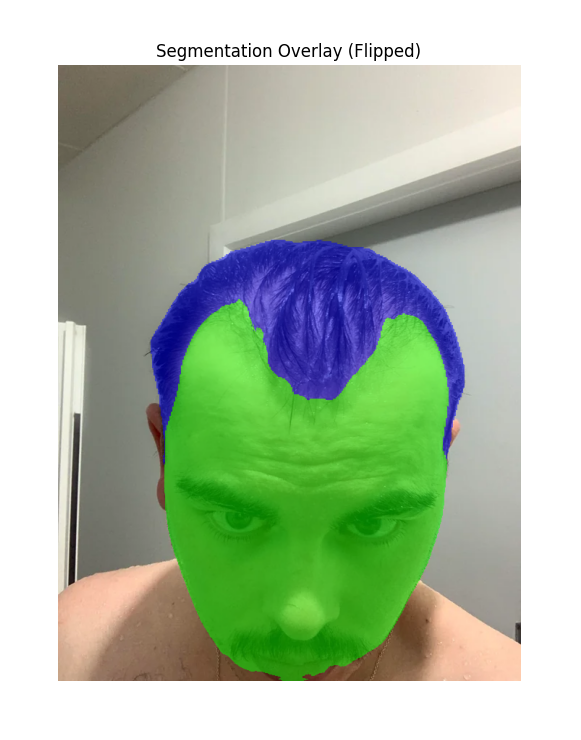

# Hairline Distance Measurement Demo

## Overview

This project demonstrates **real-time hair segmentation and eyebrow-to-hairline distance measurement** using **Google’s MediaPipe models** and a **Self-Trained Segmentation Model**.
It uses:

* **Hair segmentation** – to detect hair regions.
* **Face mesh / landmarks** – to detect eyes and eyebrows.
* **Python + OpenCV** – for live camera capture and overlay.

The main goal is to calculate **vertical distances from eyebrows to hairline** and visualize them in real time.

---

## Features

* Real-time video capture and processing.
* Hair segmentation mask visualization using MediaPipe (default) or a self-trained U-Net model.
* Automatic detection of eyebrows using MediaPipe Face Mesh.
* Vertical line overlay from eyebrows to hairline.
* Distance metrics calculation (pixel-based).

---

## Installation

1. **Clone the repository**:

```bash
git clone https://github.com/JzJoker/balance-grow.git
cd balance-grow
```

2. **Install dependencies** (Python 3.9+ recommended):

```bash
pip install -r requirements.txt
```

---

## Usage

### Run Model Demo

```bash
cd source

python inference_segmentation.py --img ..\data\test\no_hand+balding+wet.png
```
Example Output:



### Run Real-Time Mapping Demo
```bash
python main.py
```

* Opens your webcam (or image input).
* Shows hair segmentation overlay and eyebrow-to-hairline lines.
* Prints distances in pixels in the console or overlays them on the video feed.

### Parameters

* `--alpha` : Overlay transparency for hair mask (default 0.5).
* `--threshold` : Confidence threshold for hair segmentation mask (default 0.7).

---


---

## License & Attribution

This project is licensed under the **MIT License**.

**Attribution:**

* This project uses **MediaPipe**: © Google, licensed under Apache 2.0.

  * MediaPipe GitHub: [https://github.com/google/mediapipe](https://github.com/google/mediapipe)
  * Apache 2.0 license: [https://www.apache.org/licenses/LICENSE-2.0](https://www.apache.org/licenses/LICENSE-2.0)

---

## Future Work
* Implement Google's MediaPipe face mesh and hair segmentation models
* Create desktop demo for real-time mapping
* Port to **iOS** for on-device real-time measurement.
* Add metrics output in millimeters using a reference scale.
* Optimize for **higher FPS** on mobile devices.

---

## Screenshots / GIFs

*(Optional: Add a few images or short GIFs showing the overlay lines and distances.)*
